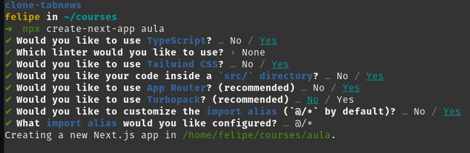
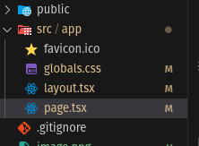
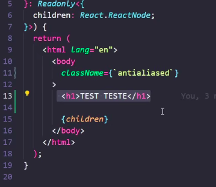
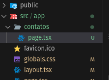
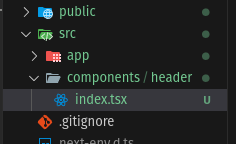

## Criação de Projeto

```bash
npx create-react-app my-app'
```



O arquivo onde tudo acontece nesse inicio é o layout.tsx. Nele, definimos a estrutura básica da aplicação, incluindo a importação dos estilos globais e a definição do layout da página.


Esse layout Global é aplicado a todas as páginas da aplicação, garantindo uma aparência consistente em todo o site.


## Criando nova página

Para criar uma nova página, basta criar uma nova pasta dentro do diretório `app` e adicionar um arquivo `page.tsx` dentro dessa pasta. Por exemplo, para criar uma página de contatos, criamos a pasta `contatos` e o arquivo `page.tsx` dentro dela.



## Criando componentes

Os componentes são criados dentro do diretório `src/components`. Cada componente deve ter sua própria pasta, contendo o arquivo principal do componente (por exemplo, `index.tsx`) e um arquivo de estilos (por exemplo, `styles.module.css`).


nele não precisamos utilizar o `default` na exportação do componente, podemos simplesmente exportá-lo como uma função nomeada.

```tsx
export function Header() {
  return <header>Header Component</header>;
}
```

Para utilizar esse arquivo, por exemplo, em todas as páginas, podemos coloca-lo no layout.tsx

```tsx
import './globals.css';
import { Header } from '@/components/header';

export default function RootLayout({
  children,
}: Readonly<{
  children: React.ReactNode;
}>) {
  return (
    <html lang="en">
      <body className="antialiased">
        <Header />
        {children}
      </body>
    </html>
  );
}
```

## Links de navegação entre páginas

Para criação de Links utilizamos o componente `Link` do `next/link`. Ele é utilizado para criar links de navegação entre as páginas da aplicação.

```tsx
import Link from 'next/link';

export function Header() {
  return (
    <header className="flex px-2 py-4 bg-zinc-10 border-b border-gray-200">
      <div className="container mx-auto flex items-center justify-between">
        <h1 className="text-2xl font-bold text-gray-800">My App</h1>
        <nav>
          <ul className="flex space-x-4">
            <li>
              <Link href="/" className="text-gray-600 hover:text-gray-800">
                Home
              </Link>
            </li>
            <li>
              <Link
                href="/contatos"
                className="text-gray-600 hover:text-gray-800"
              >
                Contatos
              </Link>
            </li>
            <li>
              <Link
                href="/dashboard"
                className="text-gray-600 hover:text-gray-800"
              >
                Dashboard
              </Link>
            </li>
          </ul>
        </nav>
      </div>
    </header>
  );
}
```
