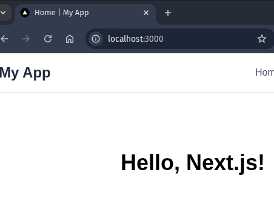

## Criação de Projeto

```bash
npx create-react-app my-app'
```


O arquivo onde tudo acontece nesse inicio é o layout.tsx. Nele, definimos a estrutura básica da aplicação, incluindo a importação dos estilos globais e a definição do layout da página.


Esse layout Global é aplicado a todas as páginas da aplicação, garantindo uma aparência consistente em todo o site.


## Criando nova página

Para criar uma nova página, basta criar uma nova pasta dentro do diretório `app` e adicionar um arquivo `page.tsx` dentro dessa pasta. Por exemplo, para criar uma página de contatos, criamos a pasta `contatos` e o arquivo `page.tsx` dentro dela.


## Criando componentes

Os componentes são criados dentro do diretório `src/components`. Cada componente deve ter sua própria pasta, contendo o arquivo principal do componente (por exemplo, `index.tsx`) e um arquivo de estilos (por exemplo, `styles.module.css`).


nele não precisamos utilizar o `default` na exportação do componente, podemos simplesmente exportá-lo como uma função nomeada.

```tsx
export function Header() {
  return <header>Header Component</header>;
}
```

Para utilizar esse arquivo, por exemplo, em todas as páginas, podemos coloca-lo no layout.tsx

```tsx
import './globals.css';
import { Header } from '@/components/header';

export default function RootLayout({
  children,
}: Readonly<{
  children: React.ReactNode;
}>) {
  return (
    <html lang="en">
      <body className="antialiased">
        <Header />
        {children}
      </body>
    </html>
  );
}
```

## Links de navegação entre páginas

Para criação de Links utilizamos o componente `Link` do `next/link`. Ele é utilizado para criar links de navegação entre as páginas da aplicação.

```tsx
import Link from 'next/link';

export function Header() {
  return (
    <header className="flex px-2 py-4 bg-zinc-10 border-b border-gray-200">
      <div className="container mx-auto flex items-center justify-between">
        <h1 className="text-2xl font-bold text-gray-800">My App</h1>
        <nav>
          <ul className="flex space-x-4">
            <li>
              <Link href="/" className="text-gray-600 hover:text-gray-800">
                Home
              </Link>
            </li>
            <li>
              <Link
                href="/contatos"
                className="text-gray-600 hover:text-gray-800"
              >
                Contatos
              </Link>
            </li>
            <li>
              <Link
                href="/dashboard"
                className="text-gray-600 hover:text-gray-800"
              >
                Dashboard
              </Link>
            </li>
          </ul>
        </nav>
      </div>
    </header>
  );
}
```

### Páginas Not Found (404)

Para criar uma página personalizada para erros 404 (página não encontrada), basta criar um arquivo `not-found.tsx` dentro da pasta `app`. Esse arquivo será automaticamente utilizado pelo Next.js quando uma rota não for encontrada.

```tsx
import Link from 'next/link';

export default function NotFound() {
  return (
    <div className="flex flex-col items-center justify-center min-h-screen bg-gray-100">
      <h1 className="text-6xl font-bold text-gray-800">404</h1>
      <p className="text-2xl text-gray-600 mt-4">Página Não Encontrada</p>

      <Link href="/" className="text-blue-600 hover:underline">
        Voltar para a Home
      </Link>
    </div>
  );
}
```

### Metadados da Página

Os metadados da página, como título e descrição, podem ser definidos diretamente no arquivo `page.tsx` de cada página. Isso é feito exportando um objeto `metadata` que contém as informações desejadas.

```tsx
import { Metadata } from 'next';

export const metadata: Metadata = {
  title: 'Home | My App',
  description: 'Welcome to My App built with Next.js',
};

export default function Home() {
  return (
    <main className="flex min-h-screen flex-col items-center justify-between p-24">
      <h1 className="text-4xl font-bold">Hello, Next.js!</h1>
    </main>
  );
}
```

Agora nossa página também já possui um titulo e uma descrição personalizada, que são importantes para SEO e para a experiência do usuário.


Caso a gente coloque essa informação no layout.tsx, ela será aplicada a todas as páginas da aplicação. Primeiro será verificado se aquela página possui metadados específicos, se não possuir, será utilizado o metadado do layout.tsx.

```tsx
import { Metadata } from 'next';
import './globals.css';
import { Header } from '@/components/header';

export const metadata: Metadata = {
  title: 'Aula Next.js | My App',
  description: 'Welcome to My App built with Next.js',
  openGraph: {
    title: 'Aula Next.js | My App',
    description: 'Welcome to My App built with Next.js',
  },
  robots: {
    index: true,
    follow: true,
    nocache: true,
  },
};

export default function RootLayout({
  children,
}: Readonly<{
  children: React.ReactNode;
}>) {
  return (
    <html lang="en">
      <body className="antialiased">
        <Header />
        {children}
      </body>
    </html>
  );
}
```
